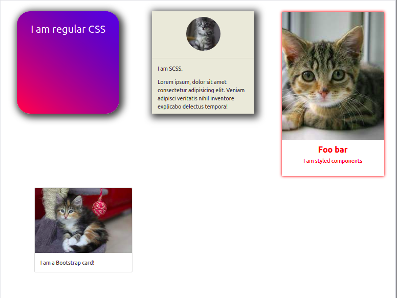

# SPA - Component - Stylish Cards

- Initialize the react app from scratch
- Use functional components
- Create the four different cards using four different techniques. 
- You don't have to follow the example exactly, but do actually make all of them distinctly different.
- Use separate components for separate cards, such as `<StyledComponentsCard />`

